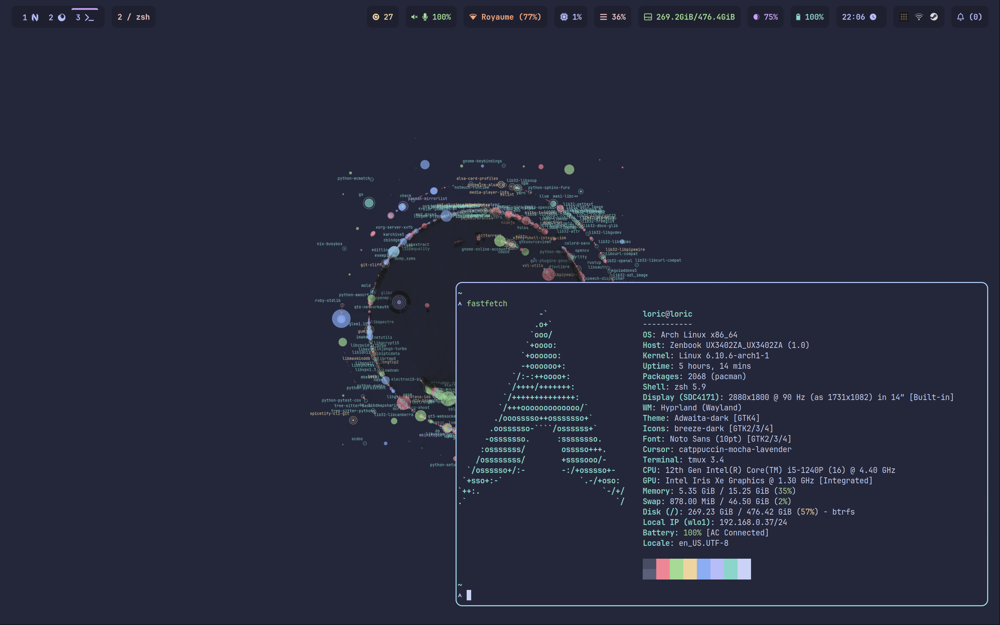

# My dotfiles, managed with chezmoi

## Included

*Note*: `Colorscheme` means that the colorscheme is managed by chezmoi.

| Category               | Tool       | Colorscheme               |
| --------               | ----       | -----------               |
| Shell | ZSH | N/A |
| WM | Hyprland | Yes |
| Terminal emulator | Kitty | Yes |
| Editor/IDE | Neovim | Yes |
| Notification daemon | Swaync | Yes |
| VCS | Git | N/A |
| VCS | Lazygit | Yes (indirect) |
| Runner | Anyrun | Yes |
| Status bar | Waybar | Yes |

## Usage

### Initial setup

```bash
sh -c "$(curl -fsLS get.chezmoi.io)" -- init --apply git@gitlab.com:loric.andre/dotfiles.git
```


### Colorscheme

To set the colorscheme, see `.chezmoidata`. Set the correct value for the `theme` key, then reload.
To add a colorscheme, see the `colors` section. The format is based on Base16.

## Showcase

### catppuccin-mocha

